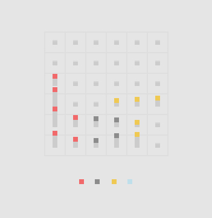

# Civilis
A little thing with squares in a grid

## running locally

The static site component of this experiment is built using [spike](https://www.spike.cf/).

Spike comes with some handy [reshape](https://reshape.ml/), [postcss](http://postcss.org/)
 and [babel](http://babeljs.io/) plugins out of the box.

Follow these instructions to get the project running locally:
- make sure [node.js](http://nodejs.org) is at version >= `6`
- `npm i spike -g`
- clone this repo down and `cd` into the folder
- run `npm install`
- run `spike watch` or `spike compile`

## Testing
Tests are located in `test/**` and are powered by [ava](https://github.com/sindresorhus/ava)
- `npm install` to ensure devDeps are installed
- `npm test` to run test suite
